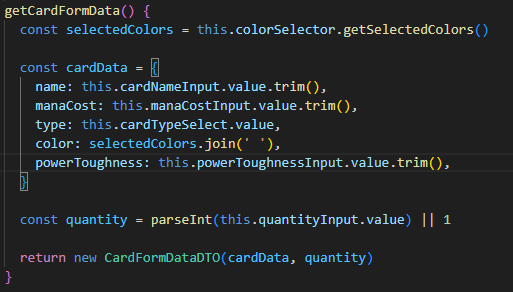
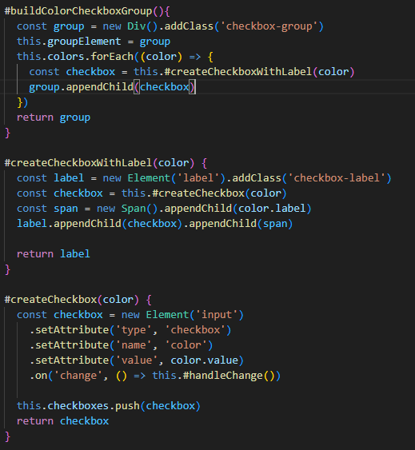
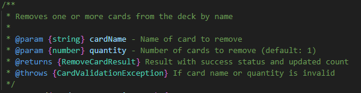
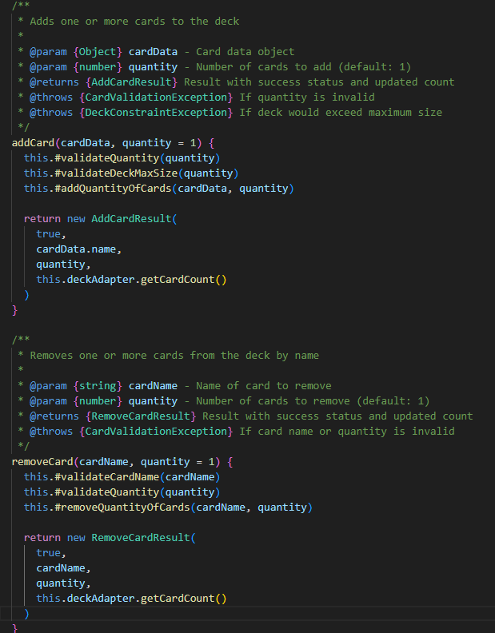
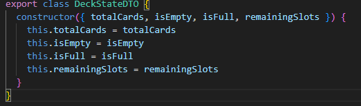
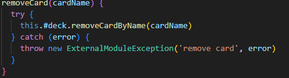
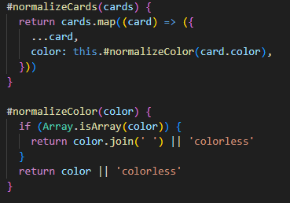
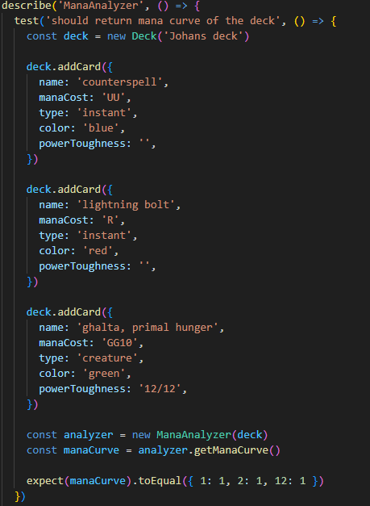
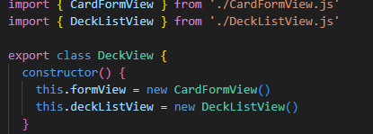
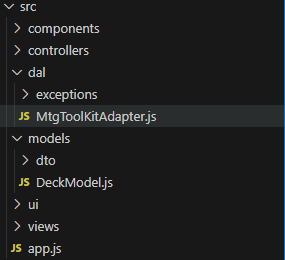

# Reflektion

## Kapitel 2
Namn som getCardFormData, selectedColors och quantity är lätta att förstå utan att behöva läsa igenom hela metoden , de berättar direkt vad de innehåller och varför de finns. Det gjorde att koden blev lättare att förstå utan att man behövde extra kommentarer. Det var svårt att hitta tydliga namn konsekvent genom appen. 

En annan utmaning var att veta när namn behöver vara beskrivande och när de blir för långa. #buildColorCheckboxGroup() är specifikt men känns tungrott, medan build() i Component är för generiskt. Balansen är svår att hitta.

## Kapitel 3
I ColorSelectorComponent försökte jag följa principen “do one thing” genom att dela upp byggandet av komponenten i flera små metoder, till exempel #buildColorCheckboxGroup(), #createCheckboxWithLabel() och #createCheckbox(). Resultatet blev fragmenterat. För att förstå hur en checkbox skapas måste man läsa tre olika metoder. Är det verkligen bättre än en enda välskriven metod? Varje metod har ett tydligt och avgränsat ansvar, vilket gör det lättare att förstå vad som händer. Genom att bryta ner logiken i flera små metoder blev flödet både renare och mer överskådligt. Att använda verb som build, create, validate och handleChange gör det direkt tydligt vad varje funktion gör.

 Jag har en tendens att lägga all logik i en enda större funktion, vilket gjorde koden svår att läsa och återanvända. Ett tydligt exempel på att jag misslyckades är #translateAddCardError() i adaptern. Den växte till över 50 rader med en lång if-else-kedja. Den "gör en sak" (översätter fel), men känns ändå fel. 

## Kapitel 4
JSDoc-kommentarer kändes redundanta för enkla metoder som exempelvis getCards(). Namnet säger ju vad den gör. Utmaningen var att veta när kod verkligen är "självförklarande" och när man bara hoppas att den är det. JSDoc-kommentarer används på publika metoder. Viss inline kommentarer förekommer för privata metoder som inte är helt självklara.

## Kapitel 5
Jag provade mig av att använda mig av ett verktyg som heter Prettier för att skriva appen. Resultatet av det var att det var svårt att överblicka och kontrollera resultatet på ett bra sätt. Hade projektet gjorts om hade en linter använts istället, då det hade gett mer kontrol och bättre överblick.

Ibland kändes det lite mekaniskt att han alla publika metoder först och privata längst ner i en fil, då det hade varit mer logiskt att gruppera metoder som nära där de används. I DeckModel.js hade det varit mer logiskt att ha #validateQuantity() direkt efter addCard() eftersom de hör ihop. Istället måste man scrolla ner 50 rader för att se valideringen.

## Kapitel 6
I appen använde jag DTOs för att samla in och skicka vidare data utan logik. De fungerar som rena datastrukturer, vilket gör det tydligt att deras syfte bara är att bära information mellan olika delar av systemet. Klasser som CardFormView och ColorSelectorComponent används som riktiga objekt med beteenden. Det blev tydligt att skillnaden mellan objekt och datastrukturer handlar om ansvar. Objekt döljer sin data och erbjuder funktionalitet. Datastrukturer exponerar data men inte logik. 

## Kapitel 7
I MtgToolKitAdapter använder jag egna feltyper som CardValidationException, DeckConstraintException och ExternalModuleException för att skapa tydliga och meningsfulla felvägar. Istället för att låta råa fel bubbla upp från den externa modulen, översätts de till egna undantag som bättre beskriver problemet i applikationens kontext. 

## Kapitel 8
MtgToolKitAdapter isolerade externa beroenden från modulen från resten av appen. Jag behövde ändra bara en sak från modulen och det var att jag ville ha color som en sträng i stället för en array i appen. Adaptern gjorde att jag bara behövde ändra på ett ställe i koden och jag visste enkelt var jag behövde leta efter att göra förändringen. Gränser mellan modulen och appen skapar distans till den verkliga funktionaliteten, man inser inte alltid värdet av gränser förrän de behövs.

Adapter-mönstret i MtgToolKitAdapter isolerade externa beroenden från modulen till appen. När data från modulen behövde anpassas som att ändra color från array till sträng så räckte det med att bara ändra på ett ställe i adaptern. Det är skönt att veta att adaptern skyddar appen om modulen skulle förändras.

## Kapitel 9
Automatiska enhetstester användes inte i appen då det skulle bli svårt att testa i användaregränssnittet. Däremot användes automatiska enhetstester i modulen. Det hade varit smidigt att ha automatiska enhetstester i appen också, då manuell testning är väldigt monoton syssla och små fel kan lätt komma igenom och vara svåra att upptäcka.  Gapet mellan testbar kod och testad kod blev tydlig då modulen känns mer utförligt testad än appen. 

## Kapitel 10
Single Responsibility Principle ledde till många små klasser. Det gav tydlighet men också fragmentering. Deckview överlåter bara till CardFormView och DeckListView, vilket gör det lättare att implementer analysdelen av modulen i framtiden genom att bara lägga till en my viewklass.

## Kapitel 11
MVC-mönstret gjorde koden välorganiserad, men skapade massor av filer. I app.js kopplas allt ihop manuellt. Det är bra för att man ser exakt vad som händer, men det är också mer jobb. Kodlagren är tydligt uppdelade mellan views, models, controllers och dal, men det blev jobbigt att hoppa mellan så många filer när man skulle följa flödet. Det blev tydligt att struktur och enkelhet ibland står i konflikt, men att en tydlig arkitektur ändå lönar sig. 

